# Lógica de Negocio: Producción y Planeación

Este documento define las reglas de negocio estrictas para el módulo de Producción. El Agente Inteligente debe consultar y respetar estas jerarquías al modificar o crear nuevas funciones.

---

## 1. Sincronización de Datos (Notion -> Supabase)

El sistema sincroniza datos desde Notion en dos fases principales:
- **Fase 1: Proyectos:** Se importan los datos de alto nivel (Código, Empresa, Fechas de Entrega).
- **Fase 2: Partidas:** Se importan las piezas individuales asociadas a cada proyecto.
    - Se utiliza `drawing_url` para vincular planos desde Google Drive.
    - Se filtran piezas por la fecha de última edición (`ZAUX-FECHA ULTIMA EDICION`).

## 2. Jerarquía para Auto-Plan (Programación Automática)

Al ejecutar "Auto-Plan", el sistema ordena las órdenes siguiendo esta jerarquía de estatus:

1.  🔴 **B-FABRICANDO COMPONENTES** (Prioridad Máxima - Trabajo en Curso)
2.  🟢 **A8-MATERIAL DISPONIBLE** (Listo para iniciar)
3.  🟡 **A7-ESPERANDO MATERIAL** (Pendiente externo)
4.  🔵 **A5-VERIFICAR MATERIAL** (Pendiente revisión)
5.  ⚪ **A0-ESPERANDO MATERIAL** (Cola de espera)

**Criterio de Desempate:** Fecha de Entrega más próxima (Ascendente).

## 3. Visualización y Avalúo (Sidebar)

La barra lateral de evaluación separa el flujo de trabajo en dos estados:
- **Por Evaluar:** Piezas activas que no tienen tiempos de máquina asignados.
- **Evaluadas:** Historial de piezas que ya tienen evaluación, permitiendo la re-edición de tiempos y máquinas.

### Planos y Documentación
- Los planos deben visualizarse en el visor integrado (Google Drive ID) sin abrir nuevas pestañas.
- Se debe priorizar la evaluación de piezas con `drawing_url` disponible.

---

## Resumen de Flujo de Trabajo

```mermaid
graph TD
    A[Sincronización Notion] --> B[Lista de Partidas]
    B --> C{¿Tiene Evaluación?}
    C -- No --> D[Pestaña 'Por Evaluar']
    C -- Sí --> E[Pestaña 'Evaluadas']
    D --> F[Evaluación Manual/Carga de CAD]
    E --> G[Edición de Tiempos/Máquinas]
    F --> H[Disponible para Auto-Plan]
    G --> H
    H --> I[Gantt Chart]
```

