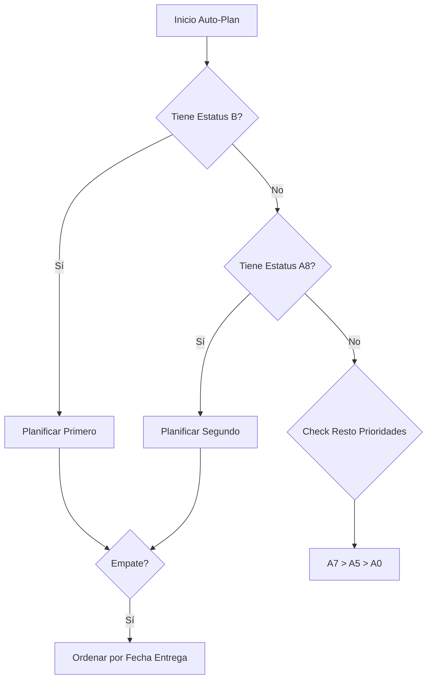

# Reglas del Agente: Jerarquías y Prioridades de Producción

Este documento define las reglas de negocio estrictas para la priorización de trabajo en el módulo de Producción. El Agente Inteligente debe consultar y respetar estas jerarquías al modificar o crear nuevas funciones de planificación.

---

## 1. Jerarquía para Auto-Plan (Programación Automática)

Al ejecutar la función "Auto-Plan", el sistema debe ordenar y programar las órdenes siguiendo estrictamente esta jerarquía.

### **Criterio Principal: Estatus General** (De Mayor a Menor Prioridad)

1.  🔴 **B-FABRICANDO COMPONENTES** (Prioridad Máxima - Trabajo en Curso)
2.  🟢 **A8-MATERIAL DISPONIBLE** (Listo para iniciar)
3.  🟡 **A7-ESPERANDO MATERIAL** (Pendiente externo)
4.  🔵 **A5-VERIFICAR MATERIAL** (Pendiente revisión)
5.  ⚪ **A0-ESPERANDO MATERIAL** (Cola de espera)

*Cualquier otro estatus tiene prioridad inferior (99).*

### **Criterio de Desempate: Urgencia**

Si dos o más órdenes tienen el **mismo estatus** (mismo nivel de jerarquía principal), se debe programar primero la que tenga la **Fecha de Entrega** más próxima (Ascendente).

### **Reglas de Planificación Parcial**
- Si una orden ya tiene horas planificadas manualmente, el Auto-Plan solo debe sugerir el **tiempo restante** (Diferencia entre Evaluación y Planificado).
- La nueva sugerencia debe comenzar **después** del último bloque de tiempo ya planificado para esa máquina.

---

## 2. Jerarquía para Avalúo (Piezas Disponibles para Evaluar)

Cuando se presentan las piezas pendientes de evaluación (asignación de tiempos y máquinas), se debe seguir este orden para enfocar la atención del planeador:

### **Criterio Principal: Disponibilidad Real**

1.  **Material Disponible (A8)**: Piezas que ya tienen material físico y solo esperan ruta.
2.  **En Proceso (B)**: Piezas que ya iniciaron pero requieren re-evaluación o ajustes.
3.  **Sin Material (A7/A0)**: Piezas que aunque se evalúen, no pueden iniciarse inmediatamente.

### **Criterio Secundario: Complejidad (Sugerido)**
- Dar prioridad a piezas con **Modelo 3D (CAD)** disponible sobre las que no lo tienen, ya que permiten una evaluación más precisa y rápida.

---

## Resumen de Lógica de Negocio

